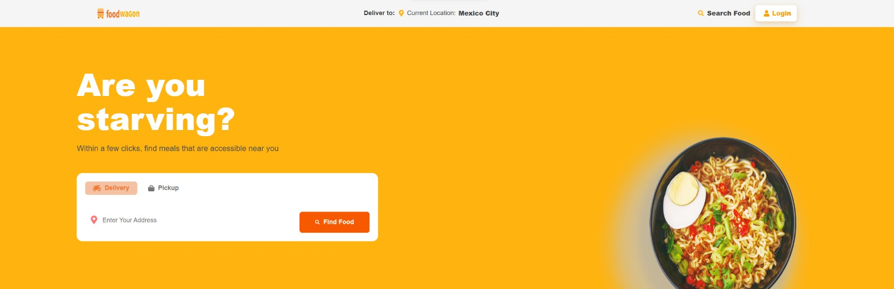
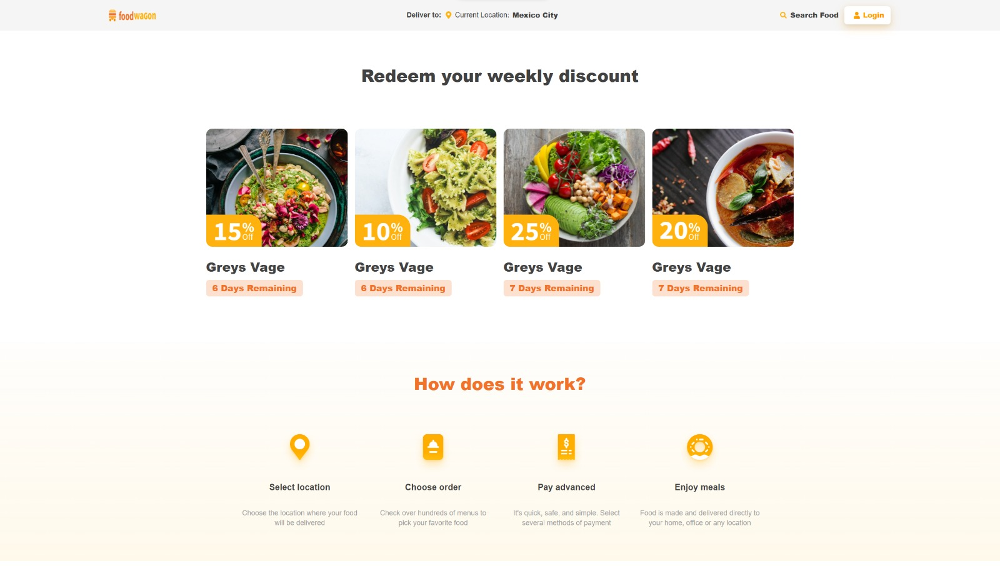
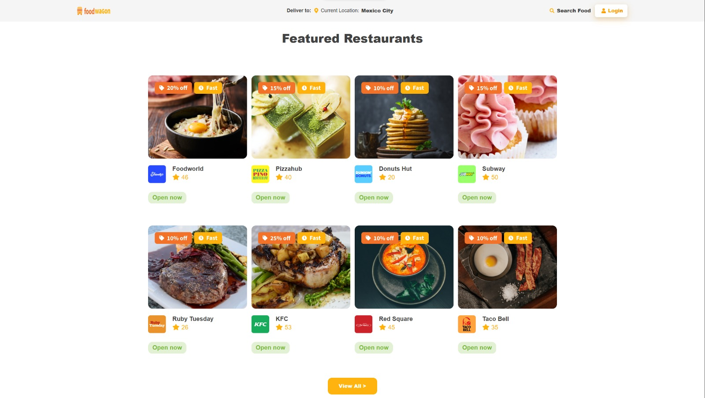
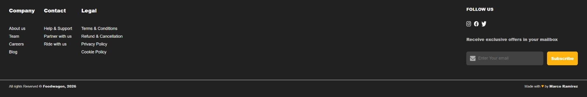

# Foodwagon — Food Delivery Landing Page

Foodwagon is a **responsive landing page** for a food delivery platform, built to showcase **modern UI layout, component structure, and responsive design** using React.

This project focuses on **frontend architecture and visual presentation**. It does not include backend or real ordering functionality.

---

## Preview

---

## Overview

- Fully responsive landing page
- Component-based architecture
- Clean and scalable layout
- UI inspired by real food delivery platforms

---

## Tech Stack

- React
- JavaScript (ES6+)
- CSS3 (Grid & Flexbox)
- Vite

---

## Features

- Full-width hero section with call-to-action
- Weekly discount cards (CSS Grid)
- Step-by-step “How it works” section
- Featured restaurants grid (max 4 per row)
- Structured footer with newsletter UI

---
